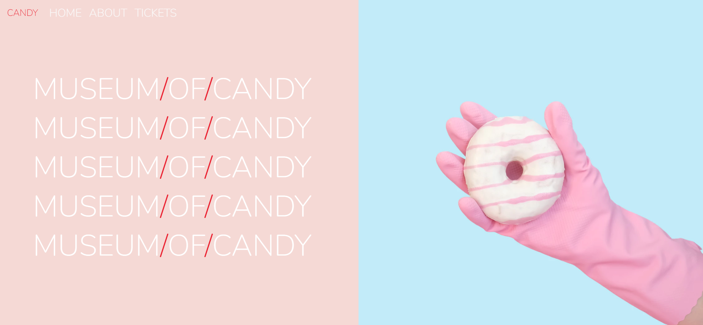
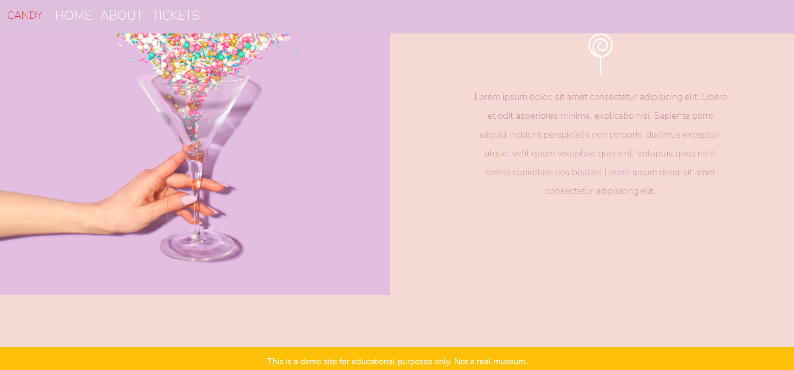
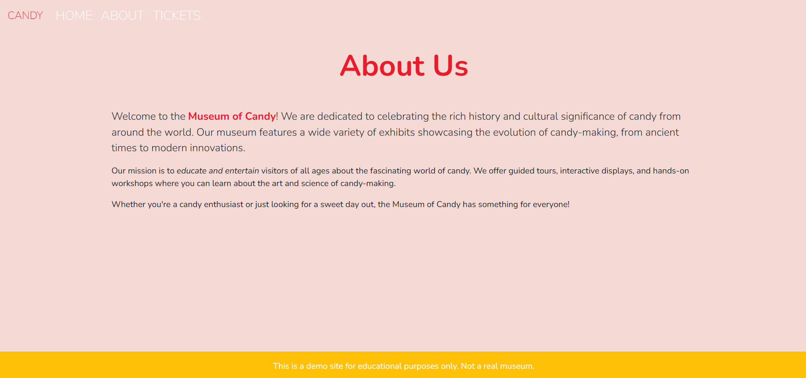
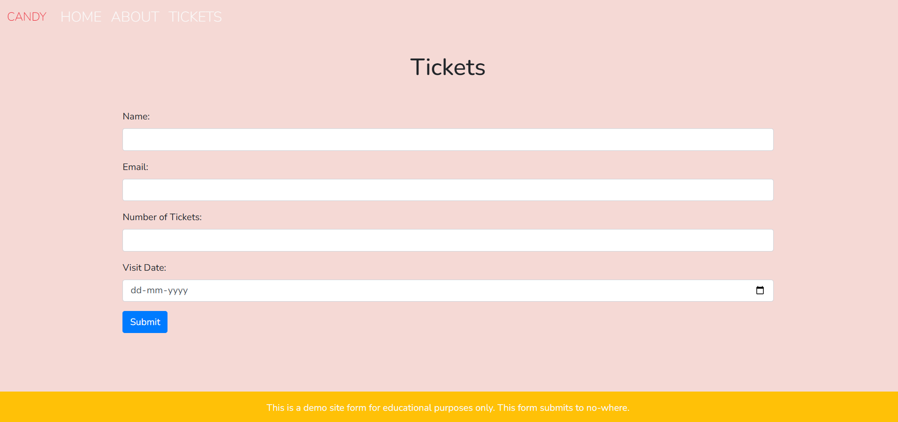

# MuseumOfCandy 🍭

**Welcome to the Museum of Candy!**  
This project is a Bootstrap-based website that showcases a fictional candy museum.  
The website is built using HTML, CSS, and Bootstrap, ensuring a responsive and visually appealing design.
> ⚠️ Note: This is a demo project built for educational purposes only.

---

## Screenshots

### Top Section


### Page Footer View


### About Page


### Tickets Form


---

## Features

- **Responsive Design:**  
Adapts to all screen sizes for consistent user experience

- **Navigation Bar:**  
Fixed-top navbar with links to Home, About, and Tickets sections

- **Image Gallery:**  
Sections with images and descriptions (Lorem Ipsum text) of the museum's exhibits.

- **Tickets Form:**  
A simple form for users to request tickets.

- **Custom Styling:**  
Custom CSS for unique styling and layout adjustments.

- **Demo Disclaimer:**  
A footer message indicating the site is for demo/educational purposes only.

---

## Technologies Used

- HTML5
- CSS3
- Bootstrap 4.6.2
- Google Fonts (Nunito)
- jQuery

---

## Getting Started

To run this project locally:
1. **Clone the repository:**
    ```bash
    git clone https://github.com/Misba0019/Museum-Of-Candy.git
    ```

2. **Open the `index.html` file in your preferred web browser.**

---

## License

This project is licensed under the MIT License - see the [LICENSE](LICENSE) file for details.